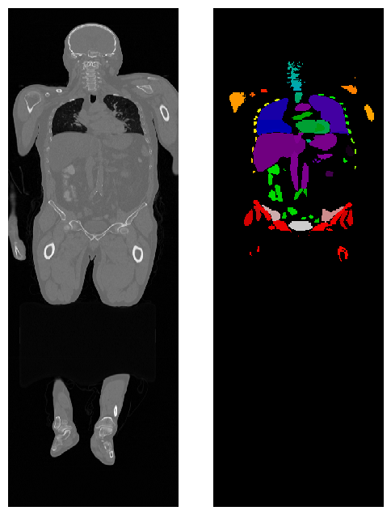

# Organ Segmentation with MONAI and TCIA Data



## Project Overview
Organ Segmentation with MONAI is a medical imaging project that focuses on leveraging MONAI, a PyTorch-based framework, to segment organs from CT scans. The project utilizes CT imaging data sourced from [The Cancer Imaging Archive (TCIA)](https://www.cancerimagingarchive.net/) and a pre-trained MONAI model for whole-body organ segmentation.

### Motivation
The project was developed to demonstrate the application of advanced deep learning techniques in medical imaging. It showcases the use of pre-trained models, preprocessing pipelines, and visualization for medical imaging tasks.

### Key Features
- Automatic download of CT scans from TCIA.
- Preprocessing and augmentation using MONAI.
- Organ segmentation using a pre-trained MONAI model.
- Visualization of CT slices and segmentation masks.
- Computation of organ-specific metrics such as volumes.

---

## Table of Contents
1. [Installation](#installation)
2. [How to Use](#how-to-use)
3. [Features](#features)
4. [Contributing](#contributing)
5. [License](#license)

---

## Installation
### Prerequisites
- Python 3.7+
- Install the required packages:
  ```bash
  pip install torch monai pydicom matplotlib tcia_utils rt-utils scipy
  ```

---

## How to Use
### Clone the Repository
```bash
git clone https://github.com/sovit-nayak/organ_segmentation.git
cd organ_segmentation
```

### Download CT Data
The script uses TCIA’s shared cart feature to download CT imaging data:
```python
from tcia_utils import nbia

cart_name = "nbia-56561691129779503"
datadir = '/path/to/your/data'

cart_data = nbia.getSharedCart(cart_name)
nbia.downloadSeries(cart_data, format="df", path=datadir)
```

### Preprocess and Segment
1. **Preprocess the CT scans** using MONAI transforms:
   ```python
   from monai.transforms import Compose, EnsureChannelFirst, Orientation

   preprocessing_pipeline = Compose([
       EnsureChannelFirst(),
       Orientation(axcodes='LPS')
   ])

   CT = preprocessing_pipeline(CT_folder)
   ```

2. **Run the pre-trained segmentation model**:
   ```python
   from monai.bundle import ConfigParser, download

   model_name = "wholeBody_ct_segmentation"
   download(name=model_name, bundle_dir=datadir)
   ```

3. **Visualize segmentation results**:
   ```python
   import matplotlib.pyplot as plt

   plt.figure(figsize=(6, 8))
   plt.imshow(segmentation[:, 250].T, cmap='nipy_spectral')
   plt.title("Segmentation Mask")
   plt.axis('off')
   plt.show()
   ```

---

## Features
- **CT Data Loading**: Fetch medical imaging datasets from TCIA.
- **Preprocessing**: Use MONAI to standardize and prepare the data for segmentation.
- **Segmentation**: Segment organs using a state-of-the-art model from MONAI's model zoo.
- **Visualization**: View both raw CT images and segmentation masks.
- **Volume Computation**: Calculate the volume of segmented organs.

---

## Contributing
Contributions are welcome! Please fork this repository and submit a pull request with your changes. For major changes, open an issue to discuss the proposed modifications.

---

## License
This project is licensed under the MIT License. See the [LICENSE](LICENSE) file for details.
